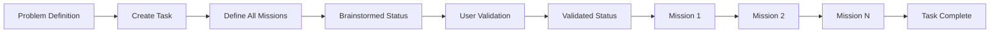
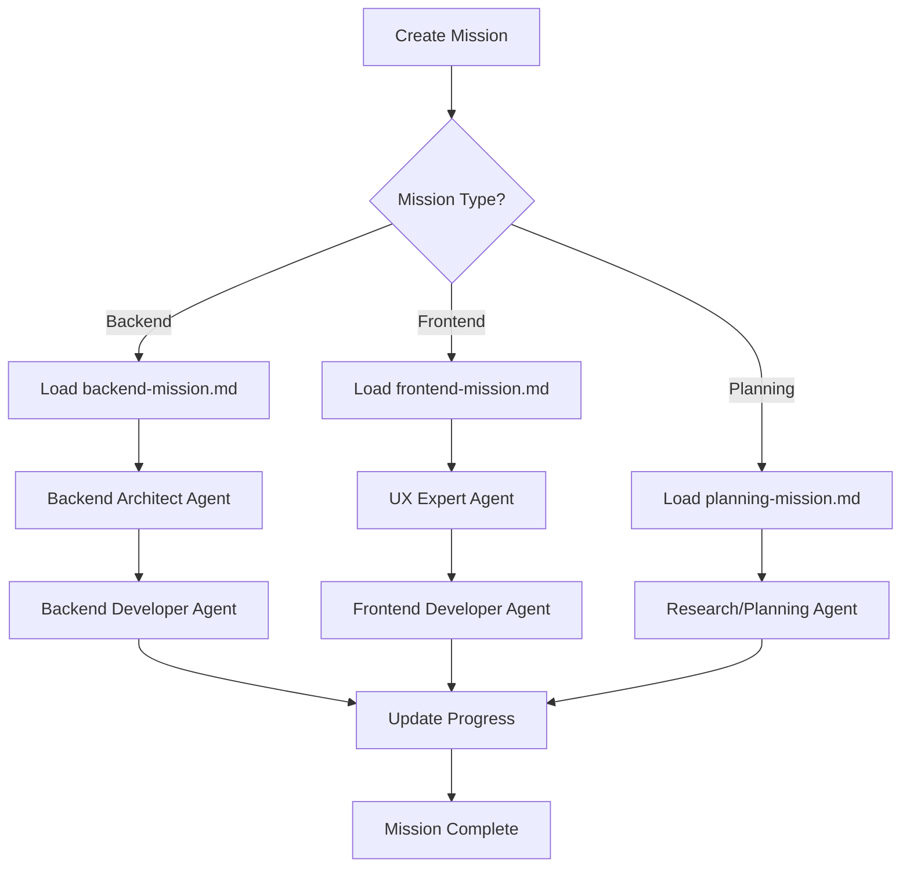

# 🚀 AB Method - Incremental Task Management System

> A revolutionary approach to software development that transforms problems into focused, incremental missions using Claude Code's specialized subagents.

## 🎯 Quick Installation

Install AB Method in your project with a single command:

```bash
npx ab-method
```

This will:
- ✅ Install all AB Method workflows in `.ab-method/`
- ✅ Add the `/ab-master` command to Claude Code
- ✅ Create necessary directories (`docs/architecture/`, `tasks/`)
- ✅ Set up or update `CLAUDE.md` with instructions

After installation, just open Claude Code and run:
```bash
/ab-master
```

That's it! You're ready to start using the AB Method.

## 📋 Table of Contents
- [Overview](#overview)
- [Core Philosophy](#core-philosophy)
- [System Architecture](#system-architecture)
- [Getting Started](#getting-started)
- [Workflow Files Documentation](#workflow-files-documentation)
- [Usage Examples](#usage-examples)
- [Task Lifecycle](#task-lifecycle)
- [Mission Execution Flow](#mission-execution-flow)
- [Architecture Documentation](#architecture-documentation)
- [Advanced Features](#advanced-features)

## 🎯 Overview

The AB Method is an incremental task management system designed specifically for Claude Code that breaks down complex software development projects into manageable tasks and missions. Each mission is completed entirely before moving to the next, building knowledge incrementally while maintaining focus and conserving context.

**For visual diagrams and detailed workflows**, see our [Eraser documentation](https://app.eraser.io/workspace/QLkAOQsRloFdVJZzqunT) (Note: The diagrams are currently a bit messy but will be refined in future updates).

## 🧠 Core Philosophy

### Key Principles:
1. **One Task at a Time** - Maintain laser focus on a single task
2. **Incremental Missions** - Each mission builds on previous knowledge
3. **Backend First** - For full-stack tasks, start with backend to provide types and data
4. **Validation Checkpoints** - User validates before implementation begins
5. **Continuous Documentation** - Architecture and progress tracked in real-time

### Why AB Method?
- **Context Conservation** - Avoid overwhelming the model with too much planning
- **Knowledge Building** - Each mission uses learnings from previous ones
- **No Redundancy** - Prevent implementing the same thing twice
- **Clear Progress** - Always know exactly where you are

## 🏗️ System Architecture

```
.claude/
└── commands/
    └── ab-master.md    # Entry point slash command

.ab-method/
├── core/                     # Core workflow files
│   ├── analyze-project.md    # Project analysis orchestrator
│   ├── analyze-frontend.md   # Frontend architecture analysis
│   ├── analyze-backend.md    # Backend architecture analysis
│   ├── update-architecture.md # Architecture documentation updater
│   ├── create-task.md        # Task creation workflow
│   ├── resume-task.md        # Task resumption workflow
│   ├── create-mission.md     # Mission creation workflow
│   └── resume-mission.md     # Mission resumption workflow
│
├── utils/                    # Mission utility files
│   ├── backend-mission.md   # Backend mission coordinator
│   ├── frontend-mission.md  # Frontend mission coordinator
│   └── planning-mission.md  # Planning mission coordinator
│
├── structure/               # Configuration
│   └── index.yaml          # Paths and structure configuration


docs/
└── architecture/           # Generated architecture docs
    ├── tech-stack.md
    ├── entry-points.md
    ├── frontend-patterns.md
    ├── backend-patterns.md
    ├── external-services.md
    └── project-constraints.md

tasks/                      # Created tasks and missions
└── [task-name]/
    ├── progress-tracker.md
    └── mission-*.md
```

## 🚦 Getting Started

### Entry Point - Always Start Here!

```bash
/ab-master [workflow-name]
```

This is your single entry point to the AB Method system. Use it to:
- View all available workflows (call without arguments)
- Start a specific workflow (provide workflow name)

### Available Workflows

| Workflow | Purpose | When to Use |
|----------|---------|-------------|
| `analyze-project` | Full project architecture analysis | Starting a new project or onboarding |
| `analyze-frontend` | Deep frontend analysis | Understanding client-side architecture |
| `analyze-backend` | Deep backend analysis | Understanding server-side architecture |
| `create-task` | Create a new development task | Starting new feature/fix |
| `resume-task` | Resume an existing task | Continuing previous work |
| `create-mission` | Create next mission for a task | Ready for next step |
| `resume-mission` | Resume an in-progress mission | Continuing mission work |
| `update-architecture` | Update architecture docs | After implementing features |

## 📁 Workflow Files Documentation

### Core Workflows

#### 🔍 `analyze-project.md`
**Purpose**: Orchestrates comprehensive project analysis using specialized subagents.

**Flow**:
1. Prompts user to confirm parallel agent deployment
2. Deploys frontend-developer and backend-architect agents simultaneously
3. Creates comprehensive architecture documentation

**Usage**:
```bash
/ab-master analyze-project
```

#### 📱 `analyze-frontend.md` & 💾 `analyze-backend.md`
**Purpose**: Deep-dive analysis of frontend/backend architecture.

**Key Features**:
- Reads from `.ab-method/structure/index.yaml` for output paths
- Creates detailed patterns documentation
- Identifies tech stack and conventions

#### 📝 `create-task.md`
**Purpose**: Creates a new task with all missions defined upfront.

**Task Status Flow**:
```
Brainstormed → Validated → In dev → Testing → Completed
```

**Process**:
1. Define problem statement, context, and expected outcome
2. Identify task type (Frontend/Backend/Full-stack)
3. Create all missions upfront
4. Initialize with "Brainstormed" status

#### 🔄 `resume-task.md` & `resume-mission.md`
**Purpose**: Resume work from exact breakpoint.

**Features**:
- Shows current progress visually
- Identifies last action and next step
- Maintains continuity across sessions

### Utility Files

#### 🔧 `backend-mission.md`
**Responsibilities**:
- Loads backend architecture documentation
- Coordinates backend-architect and backend-developer agents
- Ensures DTOs use database types for maintainability

#### 🎨 `frontend-mission.md`
**Responsibilities**:
- Loads frontend patterns and backend types
- Coordinates UX expert and frontend-developer agents
- Integrates with backend missions for type safety

#### 📊 `planning-mission.md`
**Responsibilities**:
- Loads ALL architecture documentation
- Handles research and design decisions
- Documents rationale and trade-offs

## 💡 Usage Examples

### Example 1: Starting a New Feature

```bash
# 1. Start with the master command
/ab-master create-task

# 2. System asks for problem definition
"Create a todos table that fetches from API and displays in frontend"

# 3. Creates task with missions:
# - Mission 1: Backend - Create todo model and API
# - Mission 2: Frontend - Create table component
# - Mission 3: Integration - Connect frontend to backend

# 4. System prompts for validation
"Task created with status 'Brainstormed'. Ready to validate?"

# 5. After validation, start first mission
/ab-master create-mission
```

### Example 2: Resuming Work

```bash
# Resume a task
/ab-master resume-task
> "Which task to resume?"
> "todo-table"

# Shows progress:
# ✓ Mission 1: Backend API - COMPLETED
# ⏳ Mission 2: Frontend Table - IN PROGRESS
#   Last: Created base component
#   Next: Add state management
```

## 🔄 Task Lifecycle



## 🎯 Mission Execution Flow



## 📚 Architecture Documentation

The system automatically generates and maintains architecture documentation:

### Generated Files:
- **tech-stack.md** - Technologies, frameworks, and tools
- **entry-points.md** - API endpoints and application entries
- **frontend-patterns.md** - Component architecture and patterns
- **backend-patterns.md** - API design and service patterns
- **external-services.md** - Third-party integrations
- **project-constraints.md** - Limitations and requirements

### Update Strategy:
After implementing features, run:
```bash
/ab-master update-architecture
```

This will:
1. Assess impact of changes
2. Update relevant documentation
3. Preserve history with timestamps
4. Mark deprecated features

## 🚀 Advanced Features

### Parallel Agent Execution
The analyze-project workflow deploys multiple specialized agents in parallel for maximum efficiency:
- Frontend Expert Agent
- Backend Architect Agent

### Type Safety Across Stack
Backend missions generate types that frontend missions automatically use:
```typescript
// Backend creates:
interface Todo {
  id: string;
  title: string;
  status: TodosTable["status"]; // Database type
}

// Frontend uses:
const TodoList: React.FC<{ todos: Todo[] }> = ...
```

### Incremental Knowledge Building
Each mission document contains:
- Dependencies from previous missions
- Files created/modified
- Architectural decisions
- Test results

### Configuration Flexibility
The `.ab-method/structure/index.yaml` file allows customization of:
- Documentation paths
- Task folder structure
- Workflow output locations

## 🔧 Configuration

### Structure Index (`.ab-method/structure/index.yaml`)
```yaml
project_structure:
  docs:
    architecture:
      files:
        - tech-stack.md
        - entry-points.md
        # ... more files

workflow_outputs:
  analyze-project: docs/architecture/
  analyze-frontend: docs/architecture/frontend-patterns.md
  # ... more mappings
```

## 📈 Best Practices

1. **Always start with `/ab-master`** - It's your entry point to everything
2. **Complete missions sequentially** - Don't skip ahead
3. **Validate before implementing** - Review plans before execution
4. **Update architecture regularly** - Keep docs current
5. **Use backend types in frontend** - Maintain type safety

## 🤝 Contributing

The AB Method is continuously evolving. Key areas for improvement:
- Cleaner diagram organization
- Additional mission types
- Enhanced agent coordination
- Better progress visualization

## 📝 Notes

- The system uses Claude Code's subagent capabilities extensively
- All paths are configurable via `index.yaml`
- Mission workflows delegate architecture reading to utils files
- Each workflow checks `.ab-method/structure/index.yaml` first

## 🎉 Getting Started Checklist

- [ ] Run `/ab-master` to see available workflows
- [ ] Start with `analyze-project` for new projects
- [ ] Create your first task with `create-task`
- [ ] Define missions based on task type
- [ ] Validate before starting implementation
- [ ] Complete missions one at a time
- [ ] Update architecture after major changes

---

**Remember**: The AB Method is about focused, incremental progress. One task, one mission, one step at a time. Each building on the last, creating a robust and maintainable codebase.

For questions or visual workflow diagrams, check our [Eraser documentation](https://app.eraser.io/workspace/QLkAOQsRloFdVJZzqunT).
