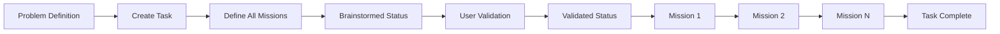
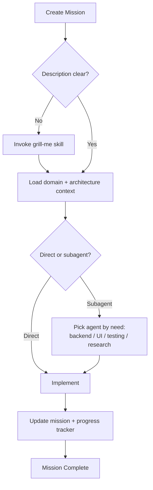
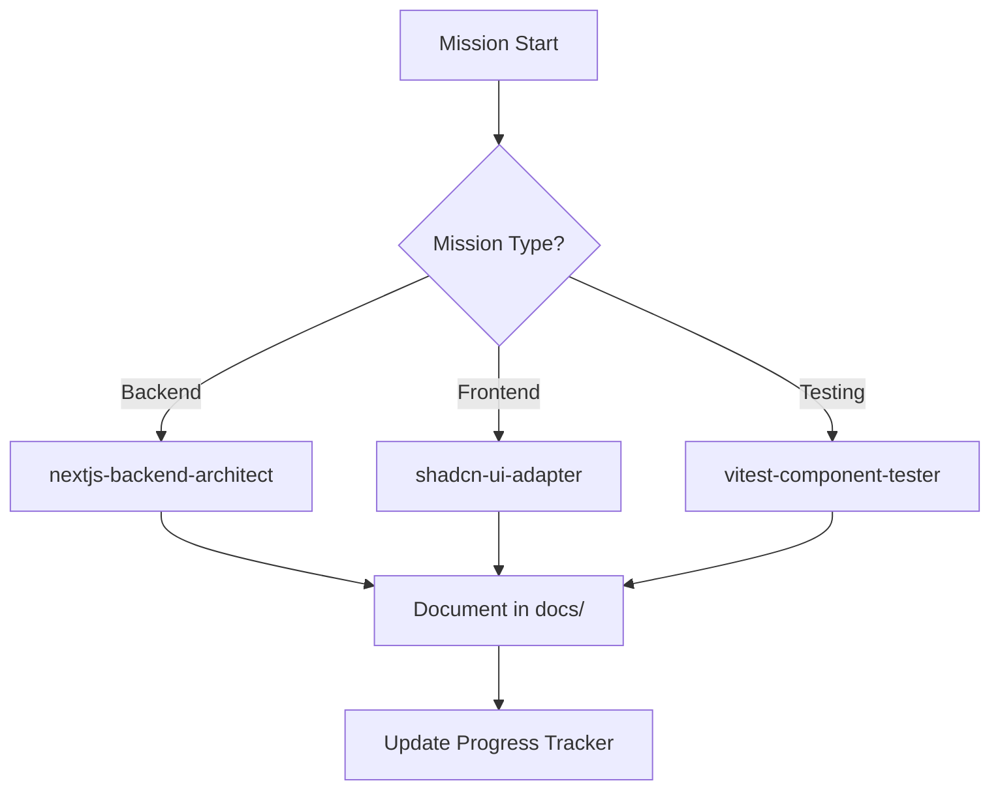

# 🚀 AB Method - Incremental Task Management System

> A revolutionary approach to software development that transforms problems into focused, incremental missions using Claude Code's specialized subagents.

## 🎯 Quick Installation

Install AB Method in your project with a single command:

```bash
npx ab-method
```

The installer **detects your environment** and installs the right things:

| Detected         | Result                                                    |
|------------------|-----------------------------------------------------------|
| `.claude/` only  | Slash commands + skills installed under `.claude/`        |
| `.agents/` only  | Skills installed under `.agents/skills/` (Codex layout)   |
| Both             | Both targets receive the right files                      |
| Neither          | Asks you which to install (default: both)                 |

In every case it also installs:
- ✅ `.ab-method/` — workflow definitions
- ✅ `docs/architecture/` and `docs/tasks/` — output scaffolding
- ✅ Skills: `grill-me`, `tdd`, `domain-model`, `ubiquitous-language`, `improve-codebase-architecture`, `request-refactor-plan`, `to-issues`, `to-prd`, `write-a-skill`
- ✅ **9 slash commands** (Claude only): `/ab-master` + 8 individual commands
- ✅ Optional built-in subagents (Claude only, prompted): shadcn-ui-adapter, nextjs-backend-architect, sst-cloud-architect, vitest-component-tester, playwright-e2e-tester, ascii-ui-mockup-generator, mastra-ai-agent-builder, qa-code-auditor

Skills are copied as real files, not symlinks — portable across OS and CI.

After installation, open Claude Code and choose your preferred approach:

**Quick Access:**
```bash
/create-task        # Create a new task. Always grills via `grill-me`,
                    # runs every mission through the `tdd` skill.
/resume-task        # Continue an existing task from its progress tracker
/extend-task        # Append new missions to an existing task
/analyze-project    # Full architecture sweep (4 agents in parallel)
# ... and 5 more individual commands
```

**Traditional Approach:**
```bash
/ab-master        # Master controller for all workflows
```

That's it! You're ready to start using the AB Method with enhanced command access.

## 📋 Table of Contents
- [Overview](#overview)
- [Core Philosophy](#core-philosophy)
- [System Architecture](#system-architecture)
- [Getting Started](#getting-started)
- [Workflow Files Documentation](#workflow-files-documentation)
- [Usage Examples](#usage-examples)
- [Task Lifecycle](#task-lifecycle)
- [Mission Execution Flow](#mission-execution-flow)
- [Architecture Documentation](#architecture-documentation)
- [Advanced Features](#advanced-features)

## 🎯 Overview

The AB Method is an incremental task management system designed specifically for Claude Code that breaks down complex software development projects into manageable tasks and missions. Each mission is completed entirely before moving to the next, building knowledge incrementally while maintaining focus and conserving context.

## 🧠 Core Philosophy

### Key Principles:
1. **Always grill** — `/create-task` invokes `grill-me` on every invocation, no skip
2. **Always TDD** — every mission runs through the `tdd` skill (red-green-refactor); the test is the spec
3. **No mission docs** — missions live as one-line entries in `progress-tracker.md`; tight technical summaries on completion
4. **One task at a time** — focus, conserve context
5. **Backend-first** for full-stack tasks (types feed the frontend)

### Why AB Method?
- **Context conservation** — minimal docs, no scaffolding-as-noise
- **Tests as spec** — TDD makes the contract executable, not aspirational
- **Domain language** — UBIQUITOUS_LANGUAGE.md + CONTEXT.md keep terms consistent across tasks
- **Clear progress** — the progress tracker is always the source of truth

## 🏗️ System Architecture

```
.claude/
└── commands/
    ├── ab-master.md            # Master controller
    ├── create-task.md          # Always grills + drives missions via tdd
    ├── resume-task.md          # Continue from progress tracker
    ├── extend-task.md          # Append missions to an existing task
    ├── test-mission.md         # Retroactive test coverage (rare)
    ├── analyze-project.md      # Full architecture sweep
    ├── analyze-frontend.md     # Frontend patterns only
    ├── analyze-backend.md      # Backend patterns only
    └── update-architecture.md  # Refresh docs after changes

.ab-method/
├── core/                       # Workflow files (one per command)
│   ├── analyze-project.md
│   ├── analyze-frontend.md
│   ├── analyze-backend.md
│   ├── create-task.md
│   ├── resume-task.md
│   ├── extend-task.md
│   ├── test-mission.md
│   └── update-architecture.md
│
└── structure/
    └── index.yaml              # Paths and outputs

UBIQUITOUS_LANGUAGE.md          # Root: domain glossary (ubiquitous-language skill format)
CONTEXT.md                      # Root: bounded-context overview (domain-model skill format)
                                # OR CONTEXT-MAP.md + per-context CONTEXT.md files

docs/
├── architecture/               # 3 lean files
│   ├── tech-stack.md           # Stack + entry points + external services + constraints + testing
│   ├── frontend-patterns.md
│   └── backend-patterns.md
├── adr/                        # Created lazily by /domain-model
│   └── 0001-*.md
└── tasks/
    └── <task-name>/
        ├── progress-tracker.md # SINGLE source of truth — missions are one-line entries
        └── sub-agents-outputs/ # only created when a subagent runs
```

## 🚦 Getting Started

### Two Ways to Access Workflows

**🚀 Quick Access (Recommended for experienced users):**
```bash
/create-task         # Always grills, drives every mission via tdd
/resume-task         # Continue from the progress tracker
/extend-task         # Append missions to an existing task
/test-mission        # Retroactive test coverage (rare — tdd handles tests upfront)
/analyze-project     # Full architecture sweep
/analyze-frontend    # Frontend patterns only
/analyze-backend     # Backend patterns only
/update-architecture # Refresh architecture/domain docs
```

**📚 Traditional Controller (Great for beginners):**
```bash
/ab-master [workflow-name]
```

The master controller provides:
- View all available workflows (call without arguments)
- Start specific workflows with guidance (provide workflow name)
- Help text and workflow descriptions

### Available Workflows

| Workflow | Purpose | When to Use |
|----------|---------|-------------|
| `analyze-project` | Full architecture sweep — UBIQ + CONTEXT + tech-stack + FE/BE patterns | New project or onboarding |
| `analyze-frontend` | Frontend patterns only | Re-analyze just the FE |
| `analyze-backend` | Backend patterns only | Re-analyze just the BE |
| `create-task` | Define a task; always grills, drives every mission through `tdd` | Starting new feature/fix |
| `resume-task` | Continue an existing task from its progress tracker | Continuing previous work |
| `extend-task` | Append new missions to an existing task | Requirements changed or scope expanded |
| `test-mission` | Retroactive test coverage | Adding tests to code not written test-first |
| `update-architecture` | Refresh architecture/domain docs | After impactful changes |

## 📁 Workflow Files Documentation

### Core Workflows

#### 🔍 `analyze-project.md`
**Purpose**: Orchestrates comprehensive project analysis using specialized subagents.

**Flow**:
1. Prompts user to confirm parallel agent deployment
2. Deploys frontend-developer and backend-architect agents simultaneously
3. Creates comprehensive architecture documentation

**Usage**:
```bash
/ab-master analyze-project
```

#### 📱 `analyze-frontend.md` & 💾 `analyze-backend.md`
**Purpose**: Deep-dive analysis of frontend/backend architecture.

**Key Features**:
- Reads from `.ab-method/structure/index.yaml` for output paths
- Creates detailed patterns documentation
- Identifies tech stack and conventions

#### 📝 `create-task.md`
**Purpose**: Creates a new task with all missions defined upfront.

**Task Status Flow**:
```
Brainstormed → Validated → In dev → Testing → Completed
```

**Process**:
1. Define problem statement, context, and expected outcome
2. Identify task type (Frontend/Backend/Full-stack)
3. Create all missions upfront
4. Initialize with "Brainstormed" status

#### 🔄 `resume-task.md`
**Purpose**: Continue an existing task from its progress tracker. No mission docs to recover — the tracker carries the mission list, prior technical summaries, and the next-up entry.

### Skill Integration

`/create-task` **always** invokes the **`grill-me`** skill (no skip, ever) to interview the user before missions are defined. The skill reads `UBIQUITOUS_LANGUAGE.md` + `CONTEXT.md` so the resulting task speaks the canonical language.

Every mission — whether created at task time or appended via `/extend-task`, whether started fresh or resumed — runs through the **`tdd`** skill. Red-green-refactor; the test is the spec.

The **`domain-model`** skill is the recommended Phase 2 after `/analyze-project` — it grills the user about `CONTEXT.md` and captures hard-to-reverse decisions in `docs/adr/`.

## 💡 Usage Examples

### Example 1: Starting a new feature

```bash
/create-task

# 1. grill-me runs (always) — resolves problem, scope, behavior,
#    constraints, existing-code anchors. One Q at a time.
# 2. Reads UBIQ + CONTEXT + tech-stack + patterns + ADRs.
# 3. Writes a slim progress-tracker.md:
#       Missions:
#       - [ ] Mission 1: Backend — POST /api/todos with Zod validation
#       - [ ] Mission 2: Backend — GET /api/todos with cursor pagination
#       - [ ] Mission 3: Frontend — TodoTable using shadcn DataTable pattern
# 4. User validates → status moves to Validated.
# 5. For each mission:
#    • load context  • invoke `tdd` skill  • red-green-refactor
#    • on completion → tight technical summary appended to tracker.
```

### Example 2: Resuming work

```bash
/resume-task
> "todo-table"

# Reads progress-tracker.md:
#   ✓ Mission 1: Backend POST — Completed
#   ✓ Mission 2: Backend GET — Completed
#   ⏳ Mission 3: Frontend TodoTable — next up
# Loads UBIQ + CONTEXT + frontend-patterns + tech-stack.
# Invokes `tdd` skill on Mission 3.
```

## 🔄 Task Lifecycle


```mermaid
graph LR
    A[Problem Definition] --> B[Create Task]
    B --> C[Define All Missions]
    C --> D[Brainstormed Status]
    D --> E[User Validation]
    E --> F[Validated Status]
    F --> G[Mission 1]
    G --> H[Mission 2]
    H --> I[Mission N]
    I --> J[Task Complete]
```

## 🎯 Mission Execution Flow


```mermaid
graph TB
    A[Create Mission] --> B{Description clear?}
    B -->|No| G[Invoke grill-me skill]
    G --> C
    B -->|Yes| C[Load domain + architecture context]
    C --> D{Direct or subagent?}
    D -->|Direct| E[Implement]
    D -->|Subagent| F[Pick agent by need:<br/>backend / UI / testing / research]
    F --> E
    E --> H[Update mission + progress tracker]
    H --> I[Mission Complete]
```

Context loaded for every mission: `UBIQUITOUS_LANGUAGE.md`, `CONTEXT.md`, `tech-stack.md`, the relevant patterns doc(s), `docs/adr/`. Agent selection is need-based, not type-based.

## 📚 Architecture Documentation

The system automatically generates and maintains architecture documentation:

### Generated Files:
- **UBIQUITOUS_LANGUAGE.md** *(root)* - Domain glossary (per `ubiquitous-language` skill format)
- **CONTEXT.md** *(root)* - Bounded-context overview (per `domain-model` skill format). Multi-context repos get `CONTEXT-MAP.md` + per-context files instead.
- **tech-stack.md** - Stack, entry points, external services, constraints, testing (merged)
- **frontend-patterns.md** - Component architecture and patterns
- **backend-patterns.md** - API design and service patterns
- **docs/adr/*.md** - Decision records, created lazily by `/domain-model`

### Update Strategy:
After implementing features, run:
```bash
/ab-master update-architecture
```

This will:
1. Assess impact of changes
2. Update relevant documentation
3. Preserve history with timestamps
4. Mark deprecated features

## 🚀 Advanced Features

### Specialized Sub-Agent System
The AB Method leverages Claude Code's specialized agents for enhanced development:

**Built-in Agents (Installed by default):**
- **shadcn-ui-adapter** - UI component creation and styling
- **nextjs-backend-architect** - Next.js backend development
- **sst-cloud-architect** - Serverless infrastructure
- **vitest-component-tester** - Component testing
- **playwright-e2e-tester** - End-to-end testing
- **ascii-ui-mockup-generator** - UI mockups and wireframes
- **mastra-ai-agent-builder** - AI agent development
- **qa-code-auditor** - Code quality analysis

**Agent Coordination Flow:**

```mermaid
graph TB
    A[Mission Start] --> B{Mission Type?}
    B -->|Backend| C[nextjs-backend-architect]
    B -->|Frontend| D[shadcn-ui-adapter]
    B -->|Testing| E[vitest-component-tester]
    C --> F[Document in docs/]
    D --> F
    E --> F
    F --> G[Update Progress Tracker]
```

### Comprehensive Documentation Output
All agent work is automatically documented in structured locations:

**Architecture Documentation:**
- `docs/architecture/` - Generated by analysis workflows
- Technical constraints, patterns, and tech stack details
- Updated continuously as missions complete

**Task Documentation:**
- `docs/tasks/[task-name]/` - Individual task folders  
- Progress trackers with technical context sections
- Mission-specific documentation with agent outputs

**Agent Output Tracking:**
Each mission tracks which agents were used and their contributions:
```markdown
## Agent Usage Tracking
### Mission 1 Agents
- nextjs-backend-architect: Created API endpoints and data models
- qa-code-auditor: Performed code quality analysis

## Sub-Agent Outputs
### Backend Architecture Plan (nextjs-backend-architect)
- Database schema: users, todos tables
- API endpoints: GET/POST /api/todos
- Type definitions: TodosTable, UserTable
```

### Enhanced Technical Context (NEW!)
Create-task workflow now includes comprehensive technical guidance:

**Technical Context Sections:**
- **Code Constraints** - File naming, coding standards, patterns
- **Architecture Hints** - Services to reuse, integration points  
- **Tech Stack Requirements** - Required libraries, versions, dependencies
- **API Constraints** - Endpoint naming, authentication patterns

**Code Guidance Sections:**  
- **File Organization** - Directory structure, import patterns
- **Testing Requirements** - Coverage expectations, test frameworks
- **Performance Considerations** - Caching, optimization requirements

### Parallel Agent Execution
The analyze-project workflow deploys multiple specialized agents in parallel for maximum efficiency:
- Frontend Expert Agent
- Backend Architect Agent

### Type Safety Across Stack
Backend missions generate types that frontend missions automatically use:
```typescript
// Backend creates:
interface Todo {
  id: string;
  title: string;
  status: TodosTable["status"]; // Database type
}

// Frontend uses:
const TodoList: React.FC<{ todos: Todo[] }> = ...
```

### Incremental Knowledge Building
Each mission document contains:
- Dependencies from previous missions
- Files created/modified
- Architectural decisions
- Test results
- Agent contributions and outputs

### Configuration Flexibility
The `.ab-method/structure/index.yaml` file allows customization of:
- Documentation paths
- Task folder structure
- Workflow output locations

## 🔧 Configuration

### Structure Index (`.ab-method/structure/index.yaml`)
```yaml
project_structure:
  root:
    files:
      - UBIQUITOUS_LANGUAGE.md
      - CONTEXT.md
  docs:
    architecture:
      files:
        - tech-stack.md
        - frontend-patterns.md
        - backend-patterns.md
    adr:
      files: []   # created lazily by /domain-model

workflow_outputs:
  analyze-project:
    - UBIQUITOUS_LANGUAGE.md
    - CONTEXT.md
    - docs/architecture/tech-stack.md
    - docs/architecture/frontend-patterns.md
    - docs/architecture/backend-patterns.md
  domain-model:
    - CONTEXT.md
    - docs/adr/
```

## 📈 Best Practices

1. **Choose your preferred command style:**
   - **Quick**: Use direct commands like `/create-task`, `/analyze-project`
   - **Guided**: Use `/ab-master` for help and workflow descriptions

2. **Complete missions sequentially** - Don't skip ahead, each builds on the previous

3. **Validate before implementing** - Review plans and technical context before execution

4. **Leverage technical context** - Fill in code constraints, architecture hints, and testing requirements during task creation

5. **Trust the agent coordination** - Let specialized agents handle their domains (UI, backend, testing)

6. **Review documentation outputs** - Check `docs/` folders for agent-generated architecture and technical details

7. **Update architecture regularly** - Use `/update-architecture` after major changes

8. **Use backend types in frontend** - Maintain type safety across the stack

## 🤝 Contributing

The AB Method is continuously evolving. Key areas for improvement:
- Cleaner diagram organization
- Additional mission types
- Enhanced agent coordination
- Better progress visualization

## 📝 Notes

- The system uses Claude Code's subagent capabilities extensively
- All paths are configurable via `index.yaml`
- Mission workflows delegate architecture reading to utils files
- Each workflow checks `.ab-method/structure/index.yaml` first

## 🎉 Getting Started Checklist

- [ ] Install: `npx ab-method` (includes builtin agents)
- [ ] Choose your style: Direct commands (`/create-task`) or guided (`/ab-master`)
- [ ] Start with `/analyze-project` for new projects (creates architecture docs)
- [ ] Create your first task with `/create-task` (includes technical context)
- [ ] Fill in technical constraints and code guidance during task creation
- [ ] Validate before starting implementation  
- [ ] Let specialized agents handle missions (creates documentation in `docs/`)
- [ ] Complete missions one at a time, review agent outputs
- [ ] Use `/update-architecture` after major changes

---

**Remember**: The AB Method is about focused, incremental progress. One task, one mission, one step at a time. Each building on the last, creating a robust and maintainable codebase.
